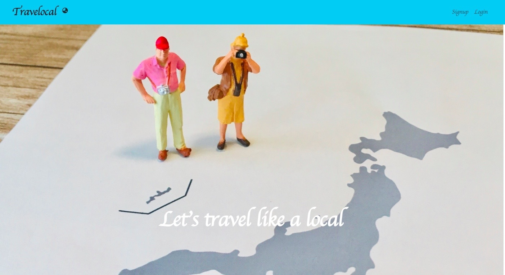
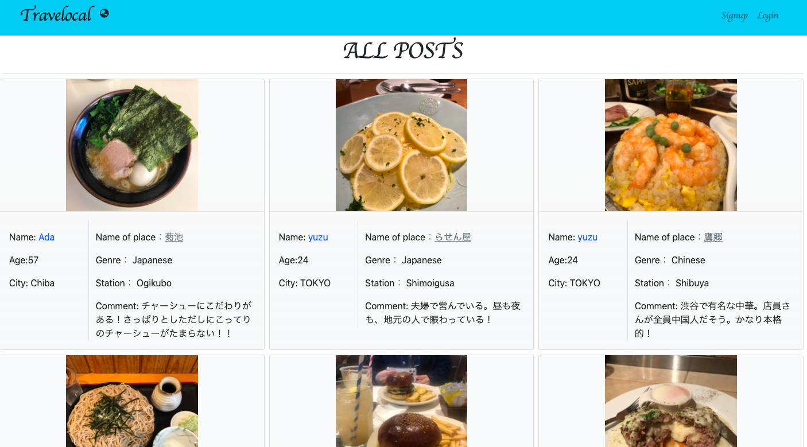
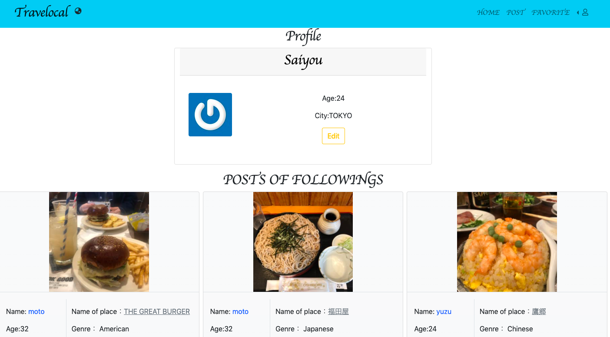
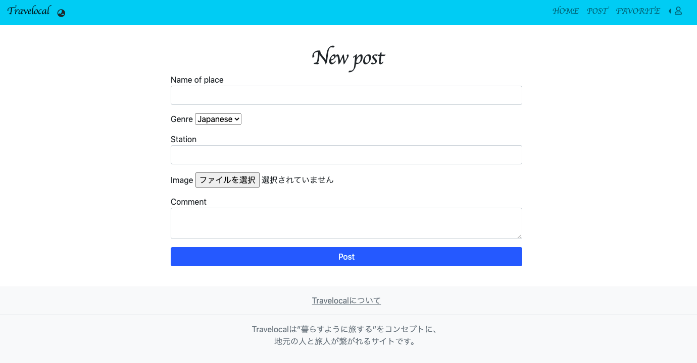
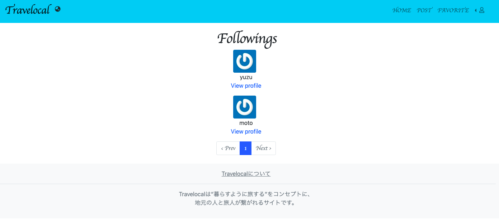
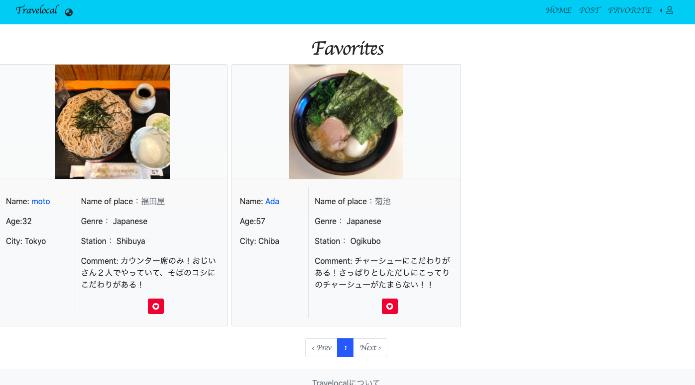

# README
## 【サービスの概要】 
名前：Travelocal 
概要：”暮らすように旅する”をコンセプトに、地元の人が普段行くお店・場所を旅人に伝えるサイトです。 

## 【サービスにかける思いや工夫したところ】 
### （思い） 
旅行の際の、「地元の人と繋がる事の楽しさ」、「知らない文化に触れる事の楽しさ」をより多くの人に味わってほしいと思い、このサイトを作りました。 
私が、学生時代に約２０カ国を旅する中で、ガイドブックには載っていないような、地元の人が普段から行くお店や場所で、そういった楽しさを味わうことができ、 
それは私の旅の中でかけがえのない思い出となっているためです。 
そのため、地元の人が普段から行くお店や場所を投稿して、旅人に伝えられるサイトを作りました。 
### 工夫したところ） 
年齢入力欄を作りました。それは、「自分と同じ世代の人が行くお店・場所」はその国の文化を知る上でとても興味深いものとなると考えたためです。 

## 【使用した技術】 
・Ruby on Rails  
・Bootstrap 
・MySQL 
・PostgreSQL 
・git/GitHub 
・Heroku 
・Carrierwave 
ーユーザー登録／ログイン機能 
ーCRUD 
ーフォロー機能 
ーお気に入り機能 
ー画像投稿機能 
ーページネーション機能 

## 【関連のURL】 
Heroku: https://travelocal.herokuapp.com/ 

## 【ページ紹介】 
#### ホーム画面

#### ログインなしで全ての投稿が見れるようになっています。

#### ログイン後はフォローしたユーザの投稿が一覧で見れます。

#### ログインしたユーザーが、新規投稿できるようになっています。

#### フォローしたユーザー、フォローされているユーザーが一覧で見れます。

#### お気に入りに追加した投稿が一覧で見れます。

